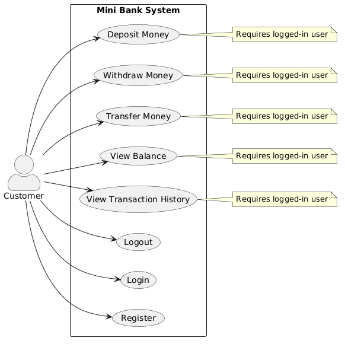
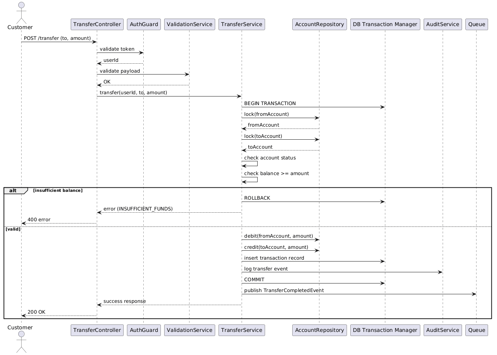
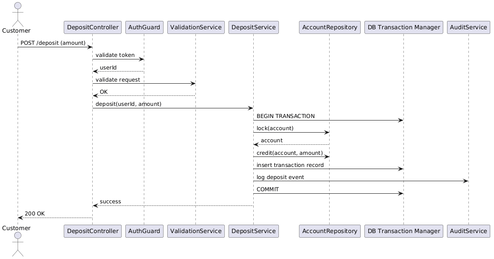
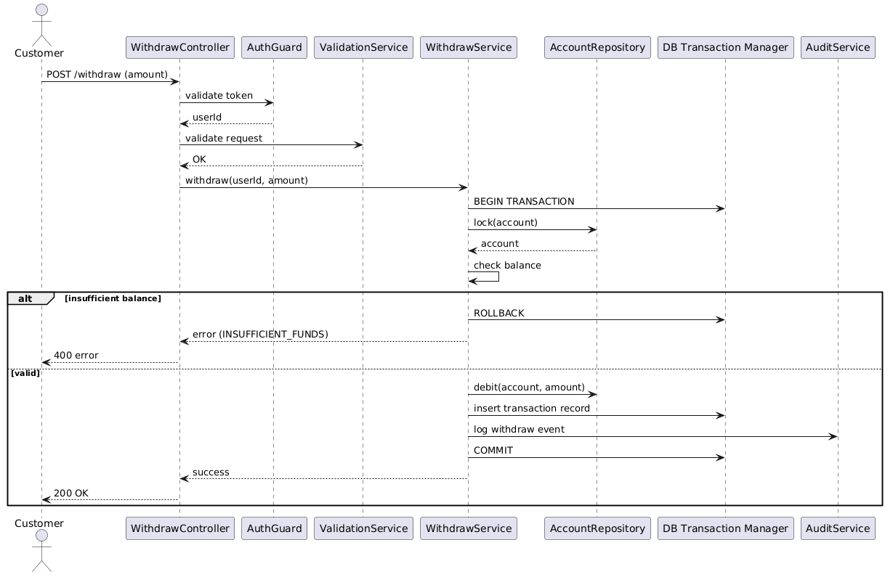

Mini Bank   A simple banking system with NodeJs and PostgreSQL 

## Description

This project is a simplified banking system designed to implement core backend engineering concepts commonly used in production-grade financial systems.   The focus is not only on basic banking operations, but also important topics such as concurrency control, data consistency, and system reliability.

📌 Key Features & Engineering Concerns

1. Core Banking Operations: 
    - Account registration and authentication
    - Deposit, withdraw, and transfer funds between accounts
    - Balance inquiry and transaction history tracking

2. Consistency & Concurrency Control
    - Prevents race conditions when updating balances
    - Ensures safe and atomic money transfers
    - Handles multiple requests on the same account correctly

3. Queue-Based Processing
    - Asynchronous processing of transactions using job queues
    - Decoupling request handling from heavy operations
    - Improving system scalability and reliability under load
    - Retry mechanisms for failed transactions

4. Audit & Transaction Traceability
    - Audit logging for all financial operations
    - Immutable transaction history for accountability
    - Tracking state changes over time

5. Performance & Query Optimization
    - Efficient database queries for balance and history retrieval
    - Index-aware data modeling for transactional tables

6. Clean Architecture & Code Quality
    - Modular and scalable system design
    - Separation of concerns between services and modules
    - Maintainable business logic layer
    - Focus on testability and future extensibility

## System Overview

These diagrams show the main flows of the system and how its parts interact with each other.

### Use Case Diagram

### Transfer Flow

### Deposit Flow

### Withdraw Flow

*You can see diagrams and `puml` files of them in `/dos` directory.*

