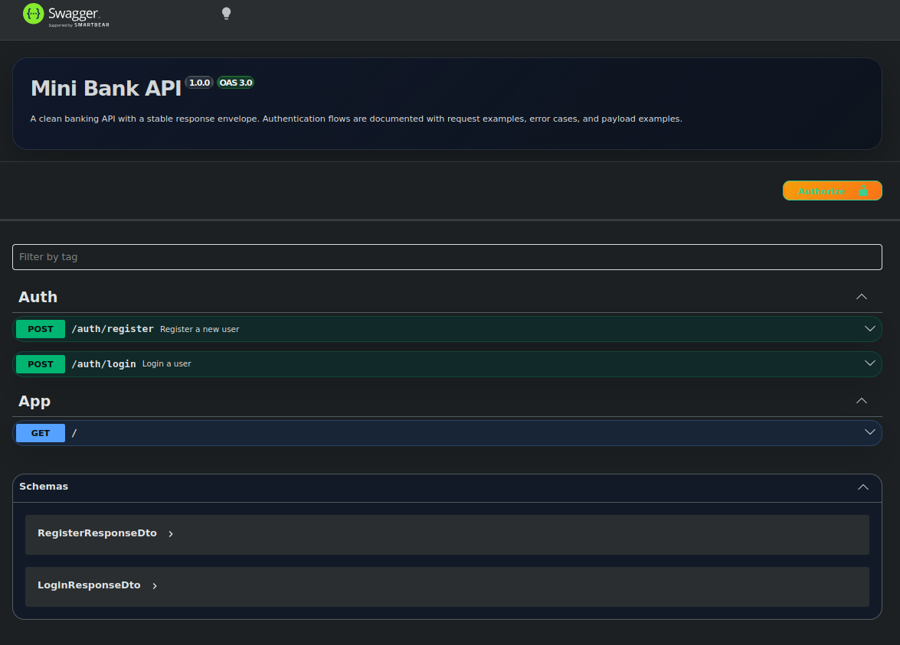

<h1>Mini Bank </h1>

This project is a simplified banking system designed to implement core backend engineering concepts commonly used in production-grade financial systems. <br> The focus is not only on basic banking operations, but also important topics such as concurrency control, data consistency, and system reliability.

📌 Key Features & Engineering Concerns

1. Core Banking Operations: 
    - Account registration and authentication
    - Deposit, withdraw, and transfer funds between accounts
    - Balance inquiry and transaction history tracking

2. Consistency & Concurrency Control
    - Prevents race conditions when updating balances
    - Ensures safe and atomic money transfers
    - Handles multiple requests on the same account correctly

3. Queue-Based Processing
    - Asynchronous processing of transactions using job queues
    - Decoupling request handling from heavy operations
    - Improving system scalability and reliability under load
    - Retry mechanisms for failed transactions

4. Audit & Transaction Traceability
    - Audit logging for all financial operations
    - Immutable transaction history for accountability
    - Tracking state changes over time

5. Performance & Query Optimization
    - Efficient database queries for balance and history retrieval
    - Index-aware data modeling for transactional tables

6. Clean Architecture & Code Quality
    - Modular and scalable system design
    - Separation of concerns between services and modules
    - Maintainable business logic layer
    - Focus on testability and future extensibility


## TO-DO list

```
- [✅] Phase 1 — Foundation
        ├── project skeleton
        ├── packages
        ├── database config + docker
        └── entities + migrations
        ├── Swagger / OpenAPI documentation
        └── repository layer separated from services

- [✅] Phase 2 — Auth
        ├── register (hash password, create user + account)
        ├── login (validate, return JWT)
        ├── JWT guard + strategy (protect routes)
        └── repository layer (UserRepository, AccountRepository)

- [✅] Phase 3 — Banking Core
        ├── AccountLockManager (SELECT FOR UPDATE)
        ├── BalanceValidator
        ├── TransactionRecorder
        └── LedgerService (coordinates all steps)

- [ ] Phase 4 — Transactions
        ├── deposit
        ├── withdraw
        └── transfer (sync for now, queue in phase 7)

- [ ] Phase 5 — Read Operations
        ├── view balance
        └── transaction history

- [ ] Phase 6 — Event System
        ├── define domain events
        ├── emit from LedgerService after commit
        ├── AuditListener → writes audit_logs
        └── QueueListener → pushes to Bull

- [ ] Phase 7 — Async Queue
        └── TransferProcessor (retry, failure handling)

```
## System Overview

These diagrams show the main flows of the system and how its parts interact with each other.

### Use Case Diagram


### Sequence diagram Flows

See Transfer flow here: [`docs/diagrams/transfer_seq_diagram.png`](docs/diagrams/transfer_seq_diagram.png)

See Deposit flow here: [`docs/diagrams/deposit_seq_diagram.png`](docs/diagrams/deposit_seq_diagram.png)

See Withdraw flow here: [`docs/diagrams/withdraw_seq_diagram.png`](docs/diagrams/withdraw_seq_diagram.png)


*🌟 You can see diagrams and `puml` files of them in `/dos` directory.*


## Project Structure

The project follows a strict layered architecture. The dependency direction always points inward: `modules` → `domain` → never back out.
```

├── src
│   ├── app.module.ts
│   ├── common                       
│   │   ├── constants
│   │   ├── decorators
│   │   ├── filters
│   │   ├── guards
│   │   ├── interceptors
│   │   ├── interfaces
│   │   ├── pipes
│   │   ├── types
│   │   └── utils
│   ├── configs
│   ├── domain
│   │   ├── banking-core
│   │   └── events
│   ├── infrastructure
│   │   ├── audit
│   │   │   ├── audit.listener.ts
│   │   │   ├── audit.module.ts
│   │   │   └── audit.service.ts
│   │   ├── database
│   │   │   ├── database.module.ts
│   │   │   ├── entities
│   │   │   ├── migrations
│   │   │   ├── repositories
│   │   │   └── seeds
│   │   │       └── currencies.seed.ts
│   │   ├── http
│   │   │   └── swagger
│   │   └── queue
│   ├── main.ts
│   └── modules
│       ├── account
│       ├── auth
│       └── transaction
│           ├── deposit
│           ├── transaction.module.ts
│           ├── transfer
│           └── withdraw
```


### Layer responsibilities at a glance

| Layer | Has controller? | Has SQL? | Has business rules? | Has external deps? |
|---|---|---|---|---|
| `modules/` | ✅ | ❌ | ❌ | ❌ |
| `domain/` | ❌ | ❌ | ✅ | ❌ |
| `infrastructure/` | ❌ | ✅ | ❌ | ✅ |
| `common/` | ❌ | ❌ | ❌ | ❌ |


## Data Model

The schema is designed around immutability and extensibility. Financial records are never updated or deleted — only appended. See [`docs/database/schema.md`](docs/database/schema.md) for the full design and all decisions.


## API Reference

The API is documented with Swagger and available at:

- `http://localhost:3000/docs`




ALL APIS:

```
✅ POST   /auth/register
✅ POST   /auth/login

GET    /account/me              ← my account info + balance
GET    /account/transactions    ← my transaction history

POST   /transaction/deposit
POST   /transaction/withdraw
POST   /transaction/transfer
```

## Running the Project

You can run the project in two ways:

- with Docker for PostgreSQL and Redis
- without Docker if you already have the required services running locally

### Prerequisites

- Node.js 20+
- npm
- PostgreSQL
- Redis

### Environment

Create a `.env` file from `.env.example` and fill in the values for:

- `DB_HOST`
- `DB_PORT`
- `DB_NAME`
- `DB_USERNAME`
- `DB_PASSWORD`
- `JWT_SECRET`
- `JWT_EXPIRES_IN`
- `REDIS_HOST`
- `REDIS_PORT`

### Run With Docker

Start the infrastructure:

```bash
docker compose up -d postgres redis
```

Run migrations:

```bash
npm run migration:run
```

Seed currencies:

```bash
npm run seed:currencies
```

Start the app:

```bash
npm run start:dev
```

### Run Without Docker

If PostgreSQL and Redis are already available on your machine:

1. Update `.env` so `DB_HOST`, `DB_PORT`, `REDIS_HOST`, and `REDIS_PORT` point to your local services.
2. Run migrations:

```bash
npm run migration:run
```

3. Seed currencies:

```bash
npm run seed:currencies
```

4. Start the app:

```bash
npm run start:dev
```


## Database Migrations

The project uses TypeORM migrations for schema management.

### Create a migration

```bash
npm run migration:create --name=your_migration_name
```

### Run migrations

```bash
npm run migration:run
```

### Revert the last migration

```bash
npm run migration:revert
```

### Seed reference data

Currency rows are seeded separately:

```bash
npm run seed:currencies
```


## Testing

> 🚧 Will cover unit tests for domain logic, integration tests for API endpoints, and concurrency scenario testing.


## Deployment

> 🚧 Will cover Docker image build, environment configuration, and production concerns.


## Tech Stack

| Layer | Technology |
|---|---|
| Runtime | Node.js |
| Framework | NestJS |
| Language | TypeScript |
| Database | PostgreSQL |
| ORM | TypeORM |
| Queue | Bull (Redis) |
| Events | @nestjs/event-emitter |
| Auth | JWT / Passport |
| Logging | Pino |
| Containerization | Docker |
| API Documentation | Swagger |


