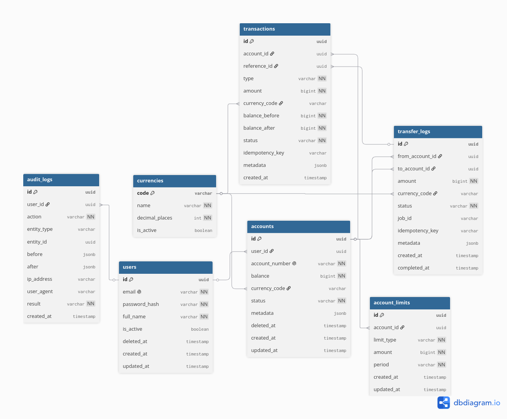

<h3 align="center">Mini Bank</h3>
<p align="center">A simplified banking system built with NestJS and PostgreSQL</p>


## Description

This project is a simplified banking system designed to implement core backend engineering concepts commonly used in production-grade financial systems.

The focus is not only on basic banking operations, but also on event-driven architecture, audit traceability, concurrency control, and system reliability — the kind of concerns that separate a working system from a production-grade one.


## Key Features & Engineering Concerns

**1. Core Banking Operations**
- Account registration and authentication
- Deposit, withdraw, and transfer funds between accounts
- Balance inquiry and transaction history tracking

**2. Event-Driven Architecture**
- Domain events emitted after every state-changing operation
- Fully decoupled side effects — audit and queue listen independently
- New features attach as listeners without modifying existing code
- Events are self-contained and emitted only after DB commit

**3. Audit & Traceability**
- Immutable audit log driven by domain events
- Every financial operation produces a traceable record with before/after snapshots
- Failed attempts logged alongside successful ones
- Append-only — audit records are never updated or deleted

**4. Consistency & Concurrency Control**
- Pessimistic locking (`SELECT FOR UPDATE`) prevents race conditions on account balances
- Atomic money transfers using DB transactions
- Idempotency keys protect against duplicate processing on client retries
- `balance_before` / `balance_after` snapshots on every transaction record

**5. Queue-Based Processing**
- Asynchronous post-transfer processing using BullMQ job queues
- Decoupling HTTP request handling from slow/external operations
- Automatic retry with exponential backoff on failure
- Notification and fraud check simulation as async processors

**6. Performance & Query Optimization**
- Composite and partial indexes on the heaviest-read tables
- Integer-based monetary storage (`BIGINT`) — no float arithmetic anywhere
- Efficient queries for balance lookup and transaction history

**7. Clean Architecture**
- Four clear layers: HTTP modules, domain, infrastructure, shared common
- Dependency direction enforced — domain never imports from infrastructure
- Each layer has a single, well-defined responsibility
- Designed for testability and future extensibility


## TO-DO List

```
- [✅] Phase 1 — Foundation
        ├── project skeleton
        ├── packages
        ├── database config + docker
        ├── entities + migrations
        ├── Swagger / OpenAPI documentation
        └── repository layer separated from services

- [✅] Phase 2 — Auth
        ├── register (hash password, create user + account)
        ├── login (validate, return JWT)
        ├── JWT guard + strategy (protect routes)
        └── repository layer (UserRepository, AccountRepository)

- [✅] Phase 3 — Banking Core
        ├── AccountLockManager (SELECT FOR UPDATE)
        ├── BalanceValidator
        ├── TransactionRecorder
        └── LedgerService (coordinates all steps)

- [✅] Phase 4 — Transactions
        ├── deposit
        ├── withdraw
        └── transfer

- [✅] Phase 5 — Read Operations
        ├── my accounts
        ├── view balance
        ├── transaction history with pagination
        └── transaction receipt

- [✅] Phase 6 — Event System
        ├── define domain events
        ├── emit from LedgerService after commit
        ├── AuditListener → writes audit_logs
        └── QueueListener → pushes to BullMQ

- [✅] Phase 7 — Async Queue
        └── TransferProcessor
              ├── notification simulation
              └── fraud check simulation

- [ ] Phase 8 — Testing
        ├── unit tests for domain logic
        ├── unit tests for auth service
        └── unit tests for queue processor
```


## System Overview

### Use Case Diagram


### Sequence Diagram Flows

| Flow | Diagram |
|---|---|
| Deposit | [`docs/diagrams/deposit_seq_diagram.png`](docs/diagrams/deposit_seq_diagram.png) |
| Withdraw | [`docs/diagrams/withdraw_seq_diagram.png`](docs/diagrams/withdraw_seq_diagram.png) |
| Transfer | [`docs/diagrams/transfer_seq_diagram.png`](docs/diagrams/transfer_seq_diagram.png) |

> PlantUML source files for all diagrams are in `/docs/plantuml/`


## Project Structure

The project follows a strict layered architecture. The dependency direction always points inward: `modules` → `domain` → never back out.

```
src/
├── common/                        # Shared NestJS building blocks, no business logic
│   ├── constants/
│   ├── decorators/                # @CurrentUser(), @IpAddress()
│   ├── filters/                   # Global exception filters
│   ├── guards/                    # JwtAuthGuard
│   ├── interceptors/
│   ├── interfaces/
│   ├── pipes/
│   ├── types/
│   └── utils/
│
├── configs/                       # Environment variable configuration
│
├── domain/                        # Business rules — no HTTP, no DB, no external deps
│   ├── banking-core/              # LedgerService, lock, validator, recorder
│   └── events/                    # Domain event definitions (plain TS classes)
│
├── infrastructure/                # Adapters for external systems
│   ├── audit/                     # AuditService + AuditListener
│   ├── database/
│   │   ├── entities/
│   │   ├── migrations/
│   │   ├── repositories/
│   │   └── seeds/
│   ├── http/
│   │   └── swagger/
│   └── queue/                     # QueueListener + TransferProcessor
│
└── modules/                       # HTTP feature modules (controllers + use-case services)
    ├── account/
    ├── auth/
    └── transaction/
        ├── deposit/
        ├── transfer/
        └── withdraw/
```

### Layer responsibilities at a glance

| Layer | Has controller? | Has SQL? | Has business rules? | Has external deps? |
|---|---|---|---|---|
| `modules/` | ✅ | ❌ | ❌ | ❌ |
| `domain/` | ❌ | ❌ | ✅ | ❌ |
| `infrastructure/` | ❌ | ✅ | ❌ | ✅ |
| `common/` | ❌ | ❌ | ❌ | ❌ |


## Data Model

The schema is designed around immutability and extensibility. Financial records are never updated or deleted.

only appended. 

See [`docs/database/schema.md`](docs/database/schema.md) for the full design and all decisions.




## API Reference

The API is documented with Swagger and available at `http://localhost:3000/docs`


```
POST   /auth/register
POST   /auth/login
GET    /auth/me

GET    /accounts/my
GET    /accounts/:accountId/balance

POST   /transaction/deposit
POST   /transaction/withdraw
POST   /transaction/transfer
GET    /transaction/history?page=1&limit=20
GET    /transaction/:transactionId/receipt
```

All protected routes require a JWT bearer token.

### Response envelope

All responses follow a consistent shape:

```json
{
  "success": true,
  "statusCode": 200,
  "message": "Request completed successfully",
  "data": {},
  "error": null
}
```

```json
{
  "success": false,
  "statusCode": 401,
  "message": "Unauthorized",
  "data": null,
  "error": {
    "code": "UNAUTHORIZED",
    "details": null
  }
}
```

### Auth

| Method | Endpoint | Description |
|---|---|---|
| POST | `/auth/register` | Creates a new user and default account in one DB transaction |
| POST | `/auth/login` | Validates credentials, returns JWT access token |
| GET | `/auth/me` | Returns the authenticated user profile |

### Accounts

| Method | Endpoint | Description |
|---|---|---|
| GET | `/accounts/my` | Returns all accounts owned by the authenticated user |
| GET | `/accounts/:accountId/balance` | Returns balance for one owned account |

### Transactions

| Method | Endpoint | Description |
|---|---|---|
| POST | `/transaction/deposit` | Deposits funds into an owned account |
| POST | `/transaction/withdraw` | Withdraws funds after balance validation |
| POST | `/transaction/transfer` | Transfers funds between accounts |
| GET | `/transaction/history` | Paginated transaction history |
| GET | `/transaction/:transactionId/receipt` | Receipt for a single transaction |


## Running the Project

### Prerequisites

- Node.js 20+
- npm
- Docker (for PostgreSQL and Redis)

### Environment setup

```bash
cp .env.example .env
```

Fill in the values in `.env`:

```
DB_HOST, DB_PORT, DB_NAME, DB_USERNAME, DB_PASSWORD
JWT_SECRET, JWT_EXPIRES_IN
REDIS_HOST, REDIS_PORT
```

### With Docker

```bash
# start PostgreSQL and Redis
docker compose up -d postgres redis

# run migrations
npm run migration:run

# seed currencies
npm run seed:currencies

# start the app
npm run start:dev
```

### Without Docker

If PostgreSQL and Redis are already running locally, update `.env` to point to them, then:

```bash
npm run migration:run
npm run seed:currencies
npm run start:dev
```


## Database Migrations

```bash
# generate a migration from entity changes
npm run migration:generate -- src/infrastructure/database/migrations/your_name

# run pending migrations
npm run migration:run

# revert the last migration
npm run migration:revert

# seed currencies
npm run seed:currencies
```

> Never edit a migration that has already been run. Never delete migration files.


## Testing

> 🚧 In progress. Will cover unit tests for domain logic, auth service, and queue processor.


## Deployment

> 🚧 Will cover Docker image build, environment configuration, and production concerns.


## Tech Stack

| Layer | Technology |
|---|---|
| Runtime | Node.js 20 |
| Framework | NestJS |
| Language | TypeScript |
| Database | PostgreSQL |
| ORM | TypeORM |
| Queue | BullMQ (Redis) |
| Events | @nestjs/event-emitter |
| Auth | JWT / Passport |
| Logging | Pino |
| Containerization | Docker |
| API Documentation | Swagger |