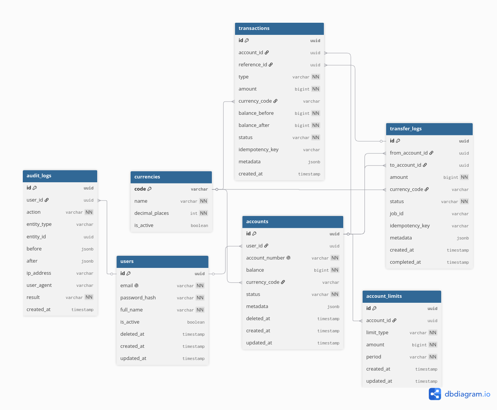

# Database Schema

The schema is designed around two core principles:
- **Immutability** — financial records are never updated or deleted, only appended
- **Extensibility** — new features (account types, currencies, limit rules) require no structural changes to existing tables

## Entity Relationship Diagram

> Generated via [dbdiagram.io](https://dbdiagram.io)



---

## Tables

### `users`

Represents a registered person in the system. Top of the ownership chain: user → accounts → transactions.

| Column | Type | Notes |
|---|---|---|
| `id` | uuid | Primary key |
| `email` | varchar | Unique, used for login |
| `password_hash` | varchar | Bcrypt hash, never plain text |
| `full_name` | varchar | Display name |
| `is_active` | boolean | Quick flag to disable access without deleting |
| `deleted_at` | timestamp | Soft delete — record is never hard-removed |
| `created_at` | timestamp | |
| `updated_at` | timestamp | |

**Why soft delete?**
A user "deleting" their account means deactivation, not removal. Transaction history must remain intact for legal and audit reasons.

---

### `currencies`

Lookup table for supported currencies. Seeded at startup, never hardcoded.

| Column | Type | Notes |
|---|---|---|
| `code` | varchar | Primary key — ISO 4217 code e.g. `IRR`, `USD` |
| `name` | varchar | Human-readable name |
| `decimal_places` | int | How many decimal places this currency uses |
| `is_active` | boolean | Toggle support without removing the record |

**Why a separate table?**
Hardcoding currency as a string on `accounts` works today but breaks the moment multi-currency is needed. This makes it a config change, not a migration.

---

### `accounts`

A financial account owned by a user. One user can own multiple accounts.

| Column | Type | Notes |
|---|---|---|
| `id` | uuid | Primary key |
| `user_id` | uuid | FK → `users.id` |
| `account_number` | varchar | Human-readable unique identifier |
| `balance` | bigint | Smallest currency unit (e.g. Tomans). Never use float for money |
| `currency_code` | varchar | FK → `currencies.code` |
| `status` | varchar | `active`, `frozen`, `closed` — app-level validation, not DB ENUM |
| `metadata` | jsonb | Escape hatch for future fields without migrations |
| `deleted_at` | timestamp | Soft delete |
| `created_at` | timestamp | |
| `updated_at` | timestamp | |

**Why `BIGINT` for balance?**
Floating point arithmetic silently corrupts monetary values at scale. Integer storage in the smallest unit with app-layer conversion is the standard in financial systems.

**Why `VARCHAR` not DB ENUM for status?**
Postgres ENUMs require `ALTER TYPE` to extend, which locks the table. `VARCHAR` validated at the app layer is equally safe and trivially extensible.

**Why `metadata: jsonb`?**
New features that need one extra field on an account go in `metadata` first. Once stable, they get promoted to a real column. Avoids premature migrations.

---

### `account_limits`

Per-account operational limits. Separated from `accounts` so new limit types never require a schema change.

| Column | Type | Notes |
|---|---|---|
| `id` | uuid | Primary key |
| `account_id` | uuid | FK → `accounts.id` |
| `limit_type` | varchar | e.g. `daily_withdrawal`, `max_transfer`, `tx_count_per_day` |
| `amount` | bigint | Limit value in smallest currency unit |
| `period` | varchar | `daily`, `monthly`, `per_transaction` |
| `created_at` | timestamp | |
| `updated_at` | timestamp | |

**Why a separate table?**
Limits vary by account type, user tier, and regulatory rules. A separate table means a new limit type is just a new row, not a migration.

---

### `transactions`

The immutable ledger. Every money movement produces a row. Rows are never updated or deleted.

| Column | Type | Notes |
|---|---|---|
| `id` | uuid | Primary key |
| `account_id` | uuid | FK → `accounts.id` |
| `reference_id` | uuid | FK → `transfer_logs.id` — only set for transfer types |
| `type` | varchar | `deposit`, `withdrawal`, `transfer_in`, `transfer_out` |
| `amount` | bigint | Always positive — direction is encoded in `type` |
| `currency_code` | varchar | FK → `currencies.code` |
| `balance_before` | bigint | Snapshot of balance before this operation |
| `balance_after` | bigint | Snapshot of balance after this operation |
| `status` | varchar | `pending`, `completed`, `failed` |
| `idempotency_key` | varchar | Client-supplied key to prevent duplicate processing |
| `metadata` | jsonb | Extra context e.g. notes, source channel |
| `created_at` | timestamp | |

**Why `balance_before` and `balance_after`?**
Point-in-time snapshots. Even if a bug corrupts the running balance on `accounts`, the full correct history can be reconstructed from these. Critical for financial audits.

**Why is `amount` always positive?**
Direction is encoded in `type`, not the sign of the amount. Makes queries simpler — `SUM(amount)` never needs sign logic.

**Why `idempotency_key`?**
When a client retries after a timeout, the server recognizes the duplicate key and returns the original result instead of processing twice. Guarantees exactly-once semantics across retries.

---

### `transfer_logs`

Tracks a transfer as a single unit. A transfer produces two `transactions` rows — this table links them and tracks async processing state.

| Column | Type | Notes |
|---|---|---|
| `id` | uuid | Primary key — referenced by `transactions.reference_id` |
| `from_account_id` | uuid | FK → `accounts.id` |
| `to_account_id` | uuid | FK → `accounts.id` |
| `amount` | bigint | |
| `currency_code` | varchar | FK → `currencies.code` |
| `status` | varchar | `pending`, `completed`, `failed` |
| `job_id` | varchar | Bull queue job ID for async tracking |
| `idempotency_key` | varchar | Same client-supplied key as on `transactions` |
| `metadata` | jsonb | |
| `created_at` | timestamp | |
| `completed_at` | timestamp | Set when both debit and credit are confirmed |

**Why a separate table?**
A transfer involves two accounts and two transaction rows that must succeed or fail together. A dedicated table keeps that relationship explicit and makes async state tracking clean.

---

### `audit_logs`

Immutable record of every significant action in the system. Driven by domain events — written by `AuditListener` after operations complete, never by business logic directly.

| Column | Type | Notes |
|---|---|---|
| `id` | uuid | Primary key |
| `user_id` | uuid | FK → `users.id` — nullable for system-initiated actions |
| `action` | varchar | `DEPOSIT`, `WITHDRAWAL`, `TRANSFER`, `LOGIN`, `LOGIN_FAILED`, `ACCOUNT_FROZEN` |
| `entity_type` | varchar | `account`, `user` |
| `entity_id` | uuid | Which account or user was affected |
| `before` | jsonb | Snapshot of state before the action |
| `after` | jsonb | Snapshot of state after the action |
| `ip_address` | varchar | |
| `user_agent` | varchar | Useful for fraud detection |
| `result` | varchar | `SUCCESS`, `FAILED` — failed attempts are logged too |
| `created_at` | timestamp | |

**Why log failed attempts?**
Three failed login attempts followed by a success is a pattern worth detecting. Only logging successes gives an incomplete picture.

**Why driven by domain events?**
`AuditListener` subscribes to domain events emitted after DB commit. This keeps audit logic fully decoupled from business logic — no service imports `AuditService` directly.

**Append-only enforcement:**
At the DB level, revoke UPDATE and DELETE from the application user:
```sql
REVOKE UPDATE, DELETE ON audit_logs FROM minibank_app;
```


## Key Design Decisions

### Money is stored as `BIGINT`
All monetary values are integers in the smallest currency unit (e.g. Tomans). Conversion happens in the application layer only, in `common/utils/money.util.ts`. Eliminates floating point errors entirely.

### No DB-level ENUMs
All status and type fields use `VARCHAR` validated at the application layer. Postgres ENUMs require table-locking `ALTER TYPE` to extend. `VARCHAR` is equally safe and trivially extensible.

### Soft deletes on `users` and `accounts`
Records are never hard-deleted. `deleted_at` is set instead. Preserves transaction history and avoids breaking foreign key references.

### Transactions and audit_logs are append-only
No `UPDATE` or `DELETE` is ever issued against these tables. The `balance_before` / `balance_after` snapshots make every operation fully traceable and independently verifiable.

### Idempotency on all mutating operations
`deposit`, `withdraw`, and `transfer` all accept a client-supplied `idempotency_key`. The server stores the key on first processing and returns the cached result on any retry. Guarantees exactly-once semantics under network failures.

### Audit is event-driven, not directly called
Business logic emits domain events. `AuditListener` in `infrastructure/audit/` subscribes to those events and writes to `audit_logs`. No service in `modules/` or `domain/` ever imports `AuditService` directly.